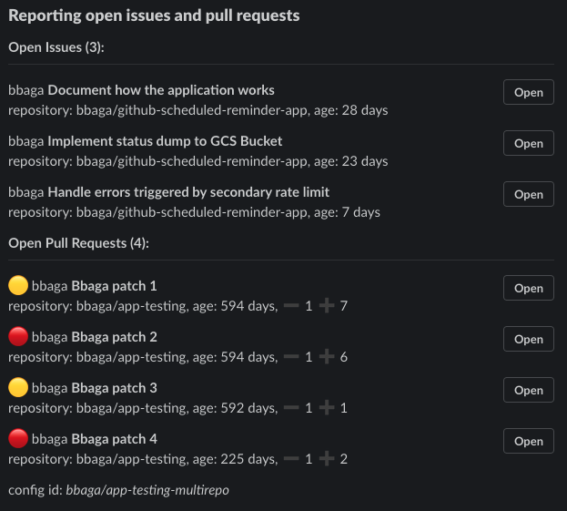

# Scheduled Reminder
Scheduled reminders about PRs and Issues. This project may be useful for teams using GitHub Enterprise versions that doesn't have [the built-in scheduled reminder](https://docs.github.com/en/organizations/organizing-members-into-teams/managing-scheduled-reminders-for-your-team) feature yet. 

> ⚠ This tool comes with no guaranties, use it with a healthy dose of caution!

## Example GitHub PR and Issue reminder on Slack:

# Documentation
The [documentation](./docs) is broken up to pages by topic, you'll find the index [here](./docs).
